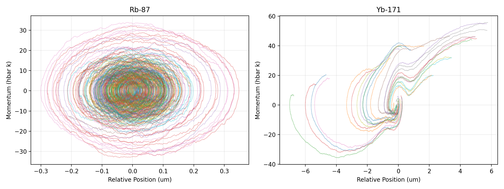
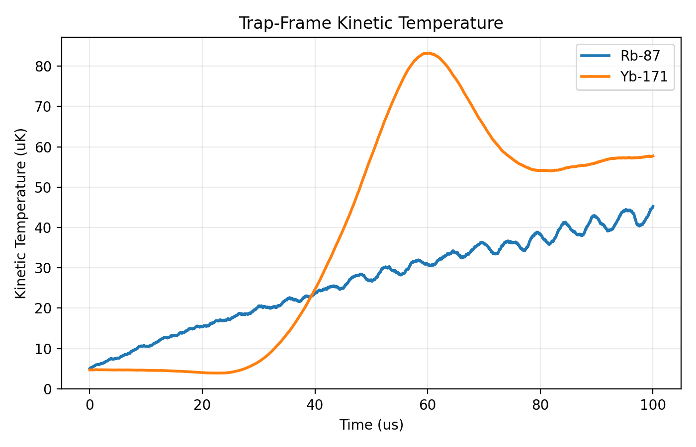
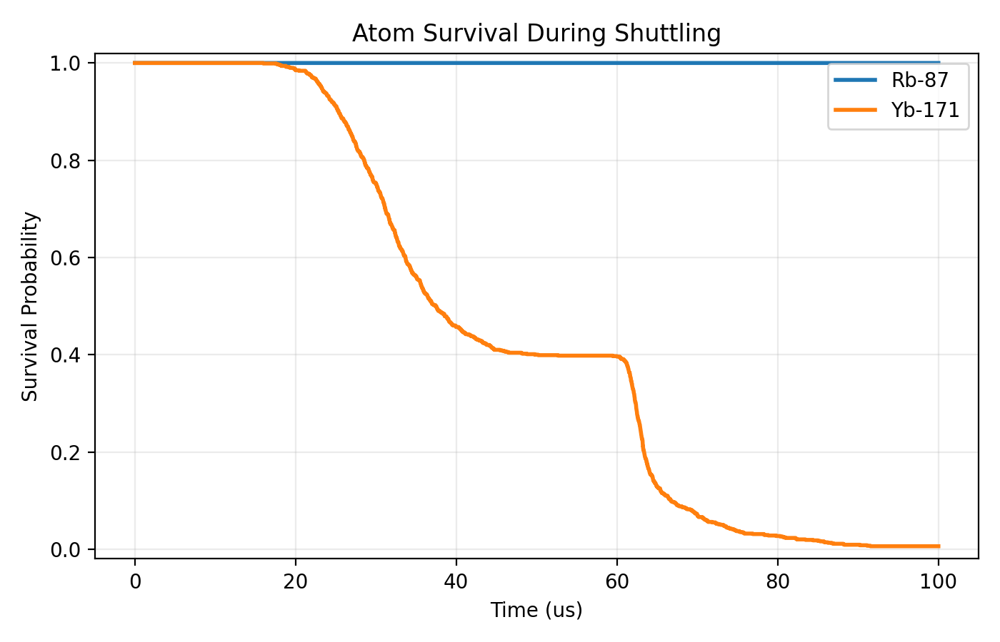

# Semiclassical Atom Shuttling Report

## Executive Summary

This repository implements a first-principles 1D semiclassical model for non-adiabatic transport of neutral atoms in optical tweezers, comparing alkali `Rb-87` against alkaline-earth-like `Yb-171`. The code follows the constraints in [AGENTS.md](../AGENTS.md): it does not use an ad hoc viscous damping term, and instead computes conservative trapping, Doppler cooling, and recoil-driven diffusion directly from atomic parameters.

Under the default shared transport profile,

- transport distance: `10 um`
- transport duration: `100 us`
- trajectories per species: `1000`
- integration time step: `20 ns`
- initial temperature: `5 uK`

the simulator produces the expected qualitative split:

- `Rb-87` remains trapped with final survival probability `1.0`
- `Yb-171` falls to final survival probability `0.006`
- `Yb-171` reaches a higher peak kinetic temperature than `Rb-87`

The dominant reason is not recoil energy, which is nearly identical for the two species, but the large linewidth and cooling-power advantage of `Rb-87` combined with the `10x` deeper default trap.

## Purpose And Scope

The goal of this model is to capture the thermodynamic and kinetic contrast between two experimentally relevant atom classes during fast shuttle motion:

- `Rb-87`, with a broad `D2` cooling transition and a relatively deep trap
- `Yb-171`, with a narrow `1S0 -> 3P1` intercombination line and a shallower trap

This version is intentionally restricted to a 1D transport-axis model in the moving trap frame. That choice keeps the implementation compact and numerically fast enough for Monte Carlo sweeps while still exposing the principal competition between:

- inertial forcing from the shuttle profile
- conservative restoring force from the tweezer
- velocity-dependent Doppler cooling
- stochastic momentum diffusion from spontaneous emission

## Governing Model

### Reference Frame

The simulator works in the frame moving with the trap center. Let `x` denote the atom position relative to the trap center and `p` its relative momentum. The imposed trap trajectory is `x_trap(t)`, so the moving frame introduces the inertial term

```text
F_inertial(t) = -m a_trap(t)
```

where `a_trap(t)` is the shuttle acceleration.

### Depth-Calibrated Dipole Potential

The prompt requires the trap to be derived from the AC Stark shift,

```text
U(x) = -(1 / (2 epsilon_0 c)) Re(alpha) I(x)
```

The implementation uses the equivalent 1D Gaussian form

```text
U(x) = -U0 exp(-2 x^2 / w0^2)
```

with

- `U0 = k_B T_depth`
- `w0 = 1.0 um` by default

and an implied effective polarizability

```text
alpha_eff = 2 epsilon_0 c U0 / I0
```

using the configured peak intensity `I0 = 2.0e10 W/m^2`.

This means the dynamics are calibrated directly to the requested trap depths while remaining consistent with the AC Stark form.

The force used in the integrator is

```text
F_dipole(x) = -dU/dx
            = -(4 U0 / w0^2) x exp(-2 x^2 / w0^2)
```

### Doppler Cooling Force

Cooling is modeled using the prompt's two-level counter-propagating beam expression:

```text
R_sc(v) = (Gamma / 2) * s0 / (1 + s0 + 4 (Delta - k v)^2 / Gamma^2)
```

and

```text
F_cool(v) = hbar k [R_sc(Delta - k v) - R_sc(Delta + k v)]
```

The default cooling settings are:

- saturation parameter `s0 = 0.2`
- detuning `Delta = -0.5 Gamma`

Because `Gamma_Rb >> Gamma_Yb`, the same normalized detuning still gives `Rb-87` much stronger damping bandwidth and much faster scattering response.

### Momentum Diffusion

Heating from photon recoil is implemented through the momentum-space diffusion coefficient

```text
D_p = (hbar^2 k^2 Gamma / 2) * s0 / (1 + s0 + 4 (Delta / Gamma)^2)
```

The stochastic kick entering Euler-Maruyama is

```text
sqrt(2 D_p dt) * N(0, 1)
```

applied independently at each step and for each trajectory.

### Stochastic Equation Of Motion

The code integrates

```text
dp = [F_dipole(x) + F_cool(p / m) - m a_trap(t)] dt + sqrt(2 D_p) dW
dx = (p / m) dt
```

using a Numba-accelerated Euler-Maruyama update.

### Survival Criterion

The current 1D escape condition is the classical bound-state test

```text
E(x, p) = p^2 / (2m) + U(x) < 0
```

If `E >= 0`, the atom is treated as lost from the trap. Survival probability is then the ensemble fraction still satisfying the bound-state condition at each time.

## Atomic Parameters

The simulator uses the prompt-specified constants exactly as implemented in [config.py](../src/atoms/config.py).

| Species | Mass (u) | Cooling wavelength | Linewidth `Gamma` | Saturation intensity | Trap depth |
| --- | ---: | ---: | ---: | ---: | ---: |
| `Rb-87` | `86.909` | `780.24 nm` | `2 pi * 6.06 MHz` | `1.67 mW/cm^2` | `1.0 mK` |
| `Yb-171` | `170.936` | `555.8 nm` | `2 pi * 182 kHz` | `0.14 mW/cm^2` | `0.1 mK` |

Important derived contrast from the default setup:

- linewidth ratio `Gamma_Rb / Gamma_Yb = 33.30`
- trap-depth ratio `U0_Rb / U0_Yb = 10.0`
- recoil-energy ratio `Erec_Yb / Erec_Rb = 1.002`

So the large transport difference is driven mainly by cooling bandwidth and trap depth, not by a fundamentally different recoil scale.

## Numerical Implementation

### Project Structure

- Core configuration: [config.py](../src/atoms/config.py)
- Minimum-jerk trajectory: [trajectory.py](../src/atoms/trajectory.py)
- Physics and Monte Carlo integrator: [physics.py](../src/atoms/physics.py)
- Plot and summary generation: [plotting.py](../src/atoms/plotting.py)
- CLI entrypoint: [simulate.py](../src/atoms/simulate.py)
- Regression tests: [test_atoms.py](../tests/test_atoms.py)

### Initial Conditions

Initial phase-space samples are drawn from a thermalized harmonic approximation near the trap center:

- `sigma_x = sqrt(k_B T / k_spring)`
- `sigma_p = sqrt(m k_B T)`

with rejection sampling applied until the initial trajectory satisfies `E < 0`.

### Shuttle Trajectory

The trap center follows a minimum-jerk profile:

```text
x_trap(t) = d [10 tau^3 - 15 tau^4 + 6 tau^5],   tau = t / T
```

This guarantees zero initial and final position derivatives through acceleration and avoids the discontinuities of a piecewise-constant acceleration protocol.

### Diagnostics

The simulation outputs:

- representative phase-space trajectories in the trap frame
- ensemble kinetic temperature
- survival probability
- a machine-readable summary JSON

`kinetic_temperature.png` uses the full-ensemble momentum variance,

```text
T_k(t) = Var[p(t)] / (m k_B)
```

while the JSON summary also reports the final trapped-only temperature when survivors remain.

## Default Experiment

The default run was generated with:

```bash
.venv/bin/python -m atoms.simulate --output-dir outputs/default_run
```

and uses:

| Parameter | Value |
| --- | ---: |
| Trajectories per species | `1000` |
| Time step | `2e-8 s` |
| Distance | `1e-5 m` |
| Duration | `1e-4 s` |
| Beam waist | `1e-6 m` |
| Peak intensity | `2e10 W/m^2` |
| Initial temperature | `5e-6 K` |
| Saturation parameter | `0.2` |
| Detuning | `-0.5 Gamma` |
| Random seed | `12345` |

## Results

### Quantitative Summary

The current default-run output in [summary.json](../outputs/default_run/summary.json) reports:

| Metric | `Rb-87` | `Yb-171` |
| --- | ---: | ---: |
| Final survival probability | `1.000` | `0.006` |
| Peak kinetic temperature | `4.52e-5 K` | `8.32e-5 K` |
| Final kinetic temperature | `4.52e-5 K` | `5.77e-5 K` |
| Final trapped-only kinetic temperature | `4.52e-5 K` | `6.23e-6 K` |
| Diffusion coefficient | `1.25e-48` | `7.39e-50` |

Additional comparisons:

- `Yb-171` reaches a peak kinetic temperature about `1.84x` higher than `Rb-87`
- the final survival gap is `0.994`
- only about `0.6%` of `Yb-171` trajectories remain bound at the end of the move

### Interpretation

The result matches the intended physical picture:

1. `Rb-87` benefits from strong Doppler cooling because its linewidth is over `33x` larger than `Yb-171`.
2. `Rb-87` also starts in a trap that is `10x` deeper in temperature units.
3. `Yb-171` receives weaker restoring and cooling support against the same imposed inertial forcing, so a large fraction of trajectories cross the `E >= 0` escape threshold during the shuttle.

One detail worth noting is that `Rb-87` has the larger diffusion coefficient in this model. That does not contradict the outcome. Diffusion alone does not determine survival; the broader transition also provides much more cooling power and a much more forgiving damping bandwidth.

### Generated Figures

Phase-space trajectories:



Kinetic temperature evolution:



Survival probability:



## Verification

The current implementation is covered by the regression suite in [test_atoms.py](../tests/test_atoms.py), including:

- unit checks for SI conversion of the species constants
- minimum-jerk boundary-condition checks
- symmetry and sign tests for the cooling and dipole forces
- a zero-motion survival regression
- a contrast regression ensuring `Yb-171` heats more and survives less than `Rb-87`
- a monotonic survival-probability check

Run verification with:

```bash
PYTHONPATH=src .venv/bin/python -m unittest discover -s tests -v
```

## Reproducibility

Environment setup uses the repo-local virtual environment and the `uv` executable installed in the conda tree:

```bash
/home/yuxuan/anaconda3/bin/uv venv .venv
/home/yuxuan/anaconda3/bin/uv pip install --python .venv/bin/python numpy scipy numba matplotlib
/home/yuxuan/anaconda3/bin/uv pip install --python .venv/bin/python -e .
```

Reproduce the default experiment:

```bash
.venv/bin/python -m atoms.simulate --output-dir outputs/default_run
```

## Current Limitations

This report should be read as a validated v1 transport model, not a full neutral-atom apparatus simulator. Important limitations are:

- 1D dynamics only; transverse escape channels are not resolved
- two-level Doppler cooling only; no multilevel structure or polarization effects
- no spatial variation of the cooling beam intensity
- no explicit axial Rayleigh-range dependence in the tweezer
- no atom-atom interactions
- no technical noise sources such as pointing jitter or trap-power fluctuations

These simplifications are intentional and keep the model aligned with the immediate goal: demonstrating why a narrow-line, shallow-trap species is much less robust to aggressive non-adiabatic shuttling than a broad-line alkali species under the same profile.

## Recommended Next Extensions

If the next step is improving physical fidelity rather than keeping the model minimal, the highest-value extensions are:

1. Extend the model to 2D or 3D so radial leakage is captured explicitly.
2. Replace the effective-depth calibration with species-specific tweezer wavelength and polarizability data.
3. Add parameter sweeps over shuttle duration, detuning, and saturation to map the Rb/Yb transport stability boundary.
4. Add batch scripts to generate multi-run reports from a grid of transport profiles.

